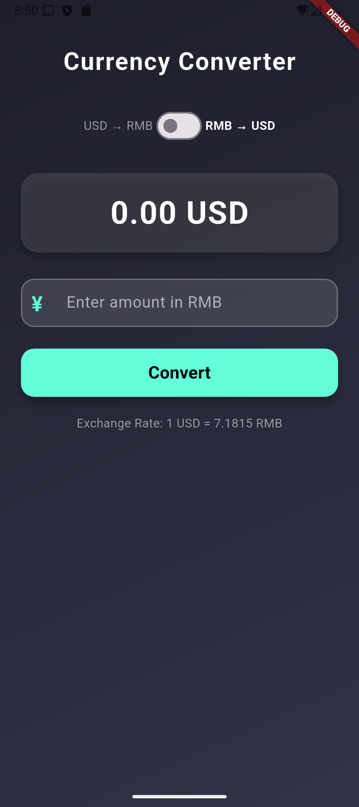

# Currency Converter 💱

A sleek Flutter app that converts **USD ↔ RMB** in real time, complete with API integration and a clean gradient UI.

---

## 🎥 Demo Video
[Watch the full tutorial on YouTube](https://www.youtube.com/watch?v=5c7vM1LkHt0)

Click the thumbnail below to watch:  
[](https://www.youtube.com/watch?v=5c7vM1LkHt0)

---

## 🖼️ Screenshots
  

---

## 🚀 Getting Started

This project is a starter for a Flutter application.

If you're new to Flutter, check out these resources:
- [Lab: Write your first Flutter app](https://docs.flutter.dev/get-started/codelab)
- [Cookbook: Useful Flutter samples](https://docs.flutter.dev/cookbook)

For detailed help, explore the  
[Flutter documentation](https://docs.flutter.dev/) for tutorials, samples, and full API references.

---

## 🔹 Installation & Run

```bash
flutter pub get  # Install dependencies
flutter run       # Launch the app
````

---

## 🛠️ Technologies Used

* **Flutter**
* **Dart**
* **HTTP package**

---

## 🚀 Project Features

* Convert **USD to RMB** and vice versa
* Fetch **live exchange rates**
* Clean and modern **UI**
* Beginner-friendly implementation

---

## 📢 Connect With Me

* **GitHub:** [codewith-rafi](https://github.com/codewith-rafi)
* **YouTube:** [Code With Rafi](https://www.youtube.com/@CodeWith_Rafi)
* **Instagram:** [@codewithrafi](https://www.instagram.com/codewithrafi/)
* **Twitter/X:** [@codewithrafi](https://twitter.com/codewithrafi)
* **LinkedIn:** [codewith-rafi](https://www.linkedin.com/in/codewith-rafi/)

⭐ If you found this project helpful, don’t forget to **star the repo** and **subscribe on YouTube** for more Flutter tutorials!

```
